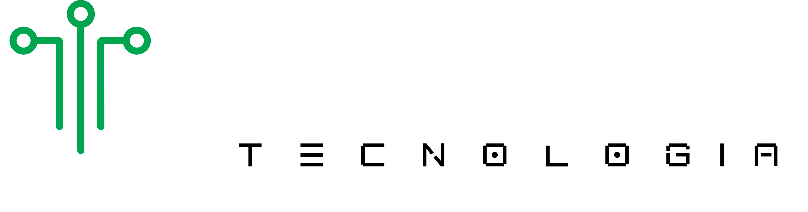
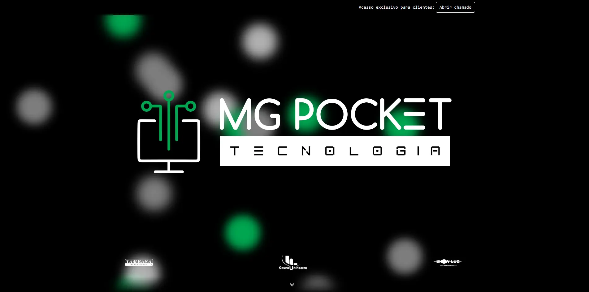

# MG Pocket - Site Institucional

<p align="center">
  
</p>

<p align="center">
  <a href="https://developer.mozilla.org/en-US/docs/Web/CSS">
    
  </a>
  <a href="https://developer.mozilla.org/en-US/docs/Web/JavaScript">
    
  </a>
  <a href="https://getbootstrap.com/">
    
  </a>
</p>

## Descrição do Projeto

Este repositório contém o código-fonte do site institucional desenvolvido para a empresa **MG Pocket**. O objetivo deste projeto é criar uma plataforma digital que represente a empresa de maneira profissional, destacando seus serviços, valores e informações de contato.

## Tecnologias Utilizadas

-  **CSS** - Estilização do layout e responsividade
-  **JavaScript** - Funcionalidades e interatividade
-  **Bootstrap** - Estruturação do layout e componentes

## Funcionalidades

- **Design Responsivo**: Otimizado para uma boa experiência tanto em dispositivos móveis quanto em desktops.
- **Navegação Simples e Intuitiva**: Foco na usabilidade para facilitar a navegação dos usuários.
- **SEO Otimizado**: Melhora a visibilidade da empresa em motores de busca.
- **Integração com Análise de Tráfego**: Ferramentas de análise para monitoramento de visitas e desempenho.

## Estrutura do Projeto

```bash
MG_Pocket/
├── css/
│   └── style.css
├── js/
│   └── script.js
├── assets/
│   └── img/
│       ├── hero-section/
│       ├── self/
│       └── slider/
└── index.html

```

## Capturas de Tela

### Página Inicial


### Sessão de Serviços


### Contato


---

### Como Contribuir

1. Faça o fork do projeto.
2. Crie uma branch com sua feature (`git checkout -b feature/nova-feature`).
3. Faça commit das suas mudanças (`git commit -m 'Adiciona nova feature'`).
4. Envie para a branch (`git push origin feature/nova-feature`).
5. Abra um Pull Request.
